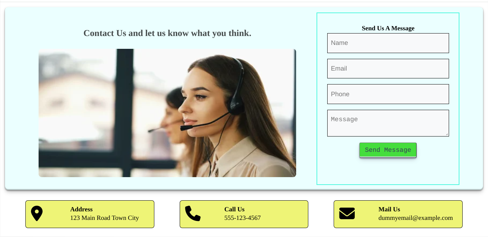

<h1 align="center" id="title">Contact Page</h1>


<p id="description">This is a React Js based Contact Page which stores user messages directly to a Google Sheet for easy access.</p>

<p align="center"></p>

<h2>🚀 Go to the app </h2>

[Visit the Live app](https://assessli-assignment-2024.vercel.app/)

<h2>Project Screenshots:</h2>



  
  
<h2>🧐 Features</h2>

Here're some of the project's best features:

*   Uses React js for a seamless user experience
*   SheetDB is being used for updating the Google Sheets
*   Responsive Web Design
*   Simple Pleasant Layout
*   Uses Font Awsome for Icons

<h2>🛠️ Installation Steps:</h2>

<p>1. Installing the setup</p>

```
 npm install  
```

<p>2. Second step is to get the Api key from the SheetDB</p>

<p>3. Put the API Key obtained from SheetDB in the environmental variables and use the documentation of SheetDB for help </p>

<p>4. For running the project locally</p>

```
 npm run dev
```

<p>5. Connect Github to vercel and deploy it through Vercel.</p>

```
https://vercel.com/
```

  
  
<h2>💻 Built with</h2>

Technologies used in the project:

*   HTML/CSS/JS
*   React Js
*   SheetDB
*   Font Awsome
*   Vercel
